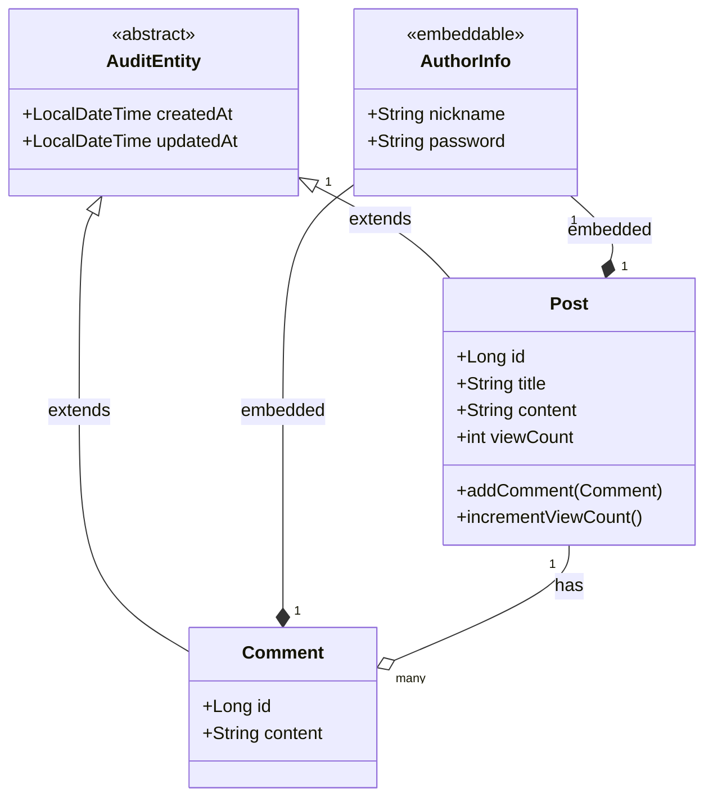

# 게시판 프로젝트

## 프로젝트 소개 및 목적

이 프로젝트는 코틀린과 스프링 프레임워크를 활용한 게시판 시스템입니다. 사용자가 게시글을 작성하고, 댓글을 달 수 있는 기본적인 기능을 제공합니다. 이 프로젝트는 다음 기술들을 학습하고 실제 애플리케이션에 적용해보기 위한 목적으로 개발되었습니다:

- Kotlin 언어 특성 및 문법
- Spring Boot 프레임워크
- JPA를 활용한 객체-관계 매핑
- Spring Data JPA를 통한 데이터 접근 계층 추상화
- Querydsl을 활용한 타입 안전한 쿼리 작성

## 기술 스택

- **언어**: Kotlin
- **프레임워크**: Spring Boot
- **데이터 접근 기술**: JPA, Spring Data JPA
- **쿼리 도구**: Querydsl
- **데이터베이스**: H2 (테스트용)

## 주요 기능

- **게시글 관리**: 게시글 작성, 조회, 수정, 삭제
- **댓글 기능**: 게시글에 댓글 작성, 조회, 수정, 삭제
- **조회수 기능**: 게시글 조회 시 조회수 증가
- **서버 사이드 렌더링**: 웹 MVC 패턴을 활용한 서버 사이드 렌더링 구현

## 엔티티 관계도

프로젝트는 다음과 같은 주요 엔티티들로 구성되어 있습니다:

- **Post**: 게시글 정보를 담당하는 엔티티
- **Comment**: 댓글 정보를 담당하는 엔티티
- **AuthorInfo**: 작성자 정보를 담당하는 임베디드 타입
- **AuditEntity**: 생성 시간, 수정 시간을 자동으로 관리하는 추상 클래스

엔티티 간의 관계:
- Post와 Comment는 일대다(1:N) 관계
- Post와 Comment는 모두 AuthorInfo를 포함(임베디드 타입)
- Post와 Comment는 모두 AuditEntity를 상속받아 감사 정보 관리

### 주요 설계 포인트

1. **양방향 연관관계**:
    - Post와 Comment는 양방향 연관관계로 설계되어 있으며, 연관관계의 주인은 Comment 엔티티입니다.

2. **임베디드 타입 활용**:
    - 작성자 정보(AuthorInfo)를 임베디드 타입으로 설계하여 코드 재사용성을 높였습니다.

3. **감사 정보 자동화**:
    - AuditEntity 추상 클래스와 Spring Data JPA의 Auditing 기능을 활용하여 생성 시간과 수정 시간을 자동으로 관리합니다.
